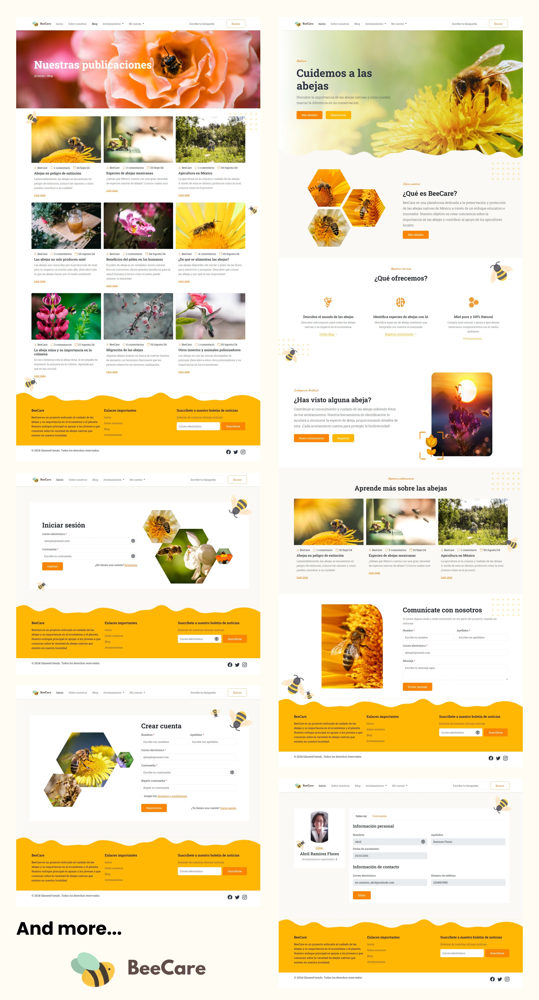

# BeeCare Website Redesign
> This website aims to encourage the community about the importance of bees and why we should take care of them. Worked with Bootstrap.
> Live demo [_here_]().


## Table of Contents
* [General Info](#general-information)
* [Technologies Used](#technologies-used)
* [Features](#features)
* [Screenshots](#screenshots)
* [Setup](#setup)
* [Usage](#usage)
* [Project Status](#project-status)
* [Acknowledgements](#acknowledgements)
* [Contact](#contact)


## General Information
"BeeCare" it's a project that I worked about 2 years ago with my team. We were in our 7th semester of college, and we decide to do this website for a competition that our professor proposed to us.

This website aims to encourage the community about the importance of bees and why we should take care of them. I decide to re-design the project giving it a better look and applying my new knowledge and skills.


## Technologies Used
         


## Features
- Responsive design
- Navbar scroll effect
- Icons8 & Bootstrap Icons
- Unsplash & Canva Images
- SweetAlert2 popup alerts

## Screenshots



## Setup
This website is built with [Bootstrap](https://getbootstrap.com/) and [Sass](https://sass-lang.com/). It uses [Font Awesome](https://fontawesome.com/) for icons.

In order to customize this website, you need to install [Node.js](https://nodejs.org/en/). Then, clone this repository and run:

```bash
npm install
```


## Usage
This will install Bootstrap, Sass and Font Awesome. To build your CSS files from Sass, run:

```bash
npm run sass:build
```

To watch your Sass files for changes, run:

```bash
npm run sass:watch
```

You can add Bootstrap variables to the `bootstrap.scss` file. You can look at the file `node_modules/bootstrap/dist/scss/_variables.scss` for a list of all the variables. Do NOT edit the `variables.scss` file directly, as it will be overwritten when you update Bootstrap.

To add your own custom styles, use the `styles.scss` file.


## Project Status
Project is: _in progress_


## Contact
Created by [@Abril Ramirez](https://iscramirezabril.github.io/) - feel free to contact me!